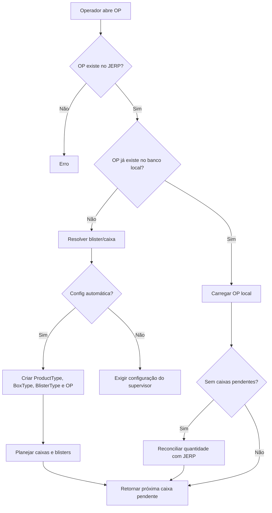
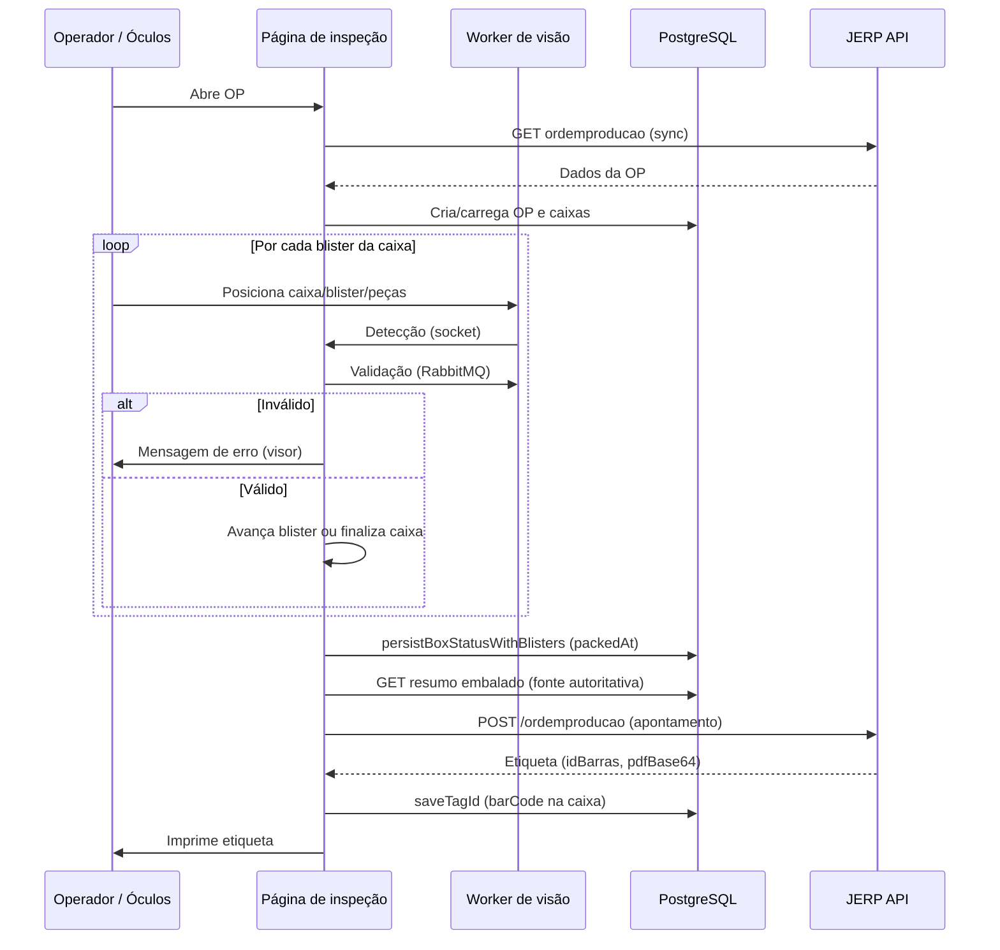
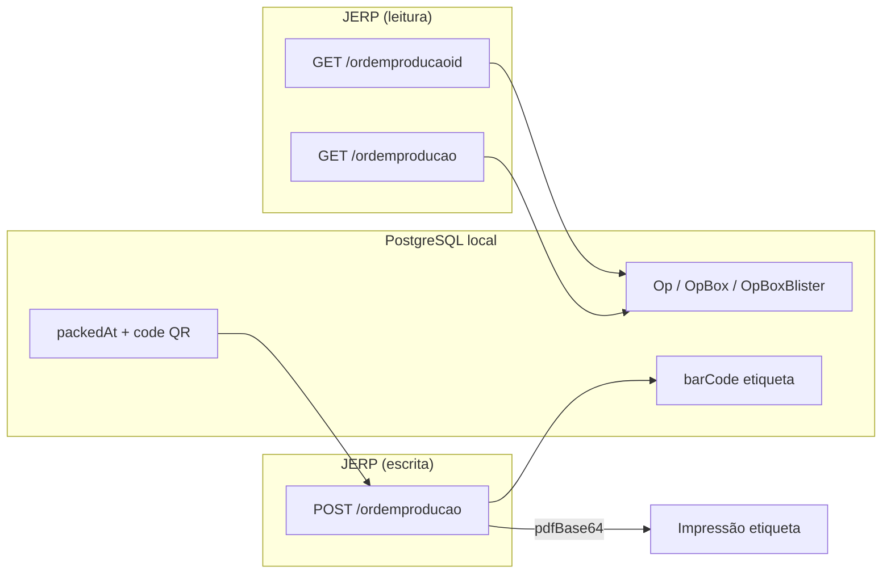

# Fluxo de apontamento e integração JERP — Inspeção e Embalagem

**Sistema:** GDE Inspeção de Embalagem (`gde-insp-embalagem`)  
**Última atualização:** 06/07/2026  
**Fonte:** código em `src/` (serviço JERP, API de etiqueta, página de inspeção e use cases)

---

## 1. Visão geral

O sistema controla a **inspeção visual** de caixas, blisters e peças (via óculos/dispositivo de visão) e, ao final de cada caixa embalada, realiza o **apontamento de produção no JERP** — que é o único momento em que dados de produção são **escritos** no ERP.

Resumo do ciclo por caixa:

```
Sincronizar OP (JERP → local) → Inspecionar caixa/blisters/peças → Persistir no banco
→ Apontar no JERP (local → JERP) → Imprimir etiqueta → Próxima caixa
```

O apontamento **não** acontece a cada blister inspecionado. Ele ocorre **uma vez por caixa**, quando a inspeção da caixa termina e a etiqueta é gerada.

---

## 2. Integrações com o JERP

### 2.1 Leitura (consulta de OP)

Usadas para sincronizar a OP, validar quantidades e reconciliar pendências. **Nenhum dado de produção é enviado** nestas chamadas.

| Método | Endpoint | Função |
|--------|----------|--------|
| `GET` | `{JERP_API}/ordemproducaoid/{id}` | Busca OP pelo ID interno do JERP |
| `GET` | `{JERP_API}/ordemproducao/{numero}` | Busca OP pelo número/código visível |
| `GET` | `{JERP_API_AUTH}/users/emails/{email}` | Autenticação (login) |
| `POST` | `{JERP_API_AUTH}/users/emails/{email}/verify-password` | Validação de senha |

**Resposta relevante (`OpJerpDto`):**

```json
{
  "id": 430505,
  "numero": 76691,
  "quantidadeAProduzir": 1080,
  "produto": { "id": 46252, "nome": "TL-06-2-0007_02" },
  "embalagens": [
    {
      "id": 47087,
      "nome": "BLISTER-...",
      "quantidadeAlocada": 180,
      "slots": 6,
      "limitePorCaixa": 8
    },
    {
      "id": 3457,
      "nome": "CAIXA 520X320X170 TRIPLEX",
      "quantidadeAlocada": 23
    }
  ]
}
```

- `quantidadeAProduzir` é o **restante a produzir** no JERP (fonte de verdade para pendência).
- `embalagens` define blister e caixa (`slots` = peças por blister; `limitePorCaixa` = blisters por caixa).

Implementação: `src/shared/services/jerp/index.ts` (`getOpFromId`, `getOpFromCode`, `getOpFromRef`).

### 2.2 Escrita (apontamento de produção)

Única operação que **registra produção** no JERP:

| Método | Endpoint | Função |
|--------|----------|--------|
| `POST` | `{JERP_API}/ordemproducao` | Apontamento de caixa + geração de etiqueta |

Implementação: `generateBarcode()` em `src/shared/services/jerp/index.ts`.

---

## 3. Preparação da OP (antes da inspeção)

Ao abrir `/op/{opId}`, o sistema chama `syncAndGetOpToProduceById`:



### 3.1 Criação da OP local

Quando a OP ainda não existe no PostgreSQL:

1. Valida dados do JERP (`validateOpJerpToProduce`).
2. Seleciona embalagens de blister e caixa (`selectOpPackagings`).
3. Resolve `slots` e `limitPerBox` do blister (JERP, histórico do produto ou supervisor).
4. Cria registros locais: `ProductType`, `BoxType`, `BlisterType`, `Op`, `OpBox`, `OpBoxBlister`.

### 3.2 Planejamento de caixas

A partir de `quantidadeAProduzir` do JERP:

```
blisters totais  = ceil(quantidade / slots)
caixas totais    = ceil(blisters / limitPerBox)
última caixa     = pode ter menos blisters e o último blister pode ter menos peças
```

Exemplo: 1.080 peças, 6 slots, 8 blisters/caixa → 180 blisters → 23 caixas (última com 4 blisters × 6 = 24 peças).

Implementação: `createOpBoxesData` em `src/usecases/op/create-op-data.ts`.

### 3.3 Reconciliação de quantidade (leitura JERP)

Se não há caixas pendentes localmente, o sistema atualiza `quantityToProduce` local:

```
quantityToProduce = peças já embaladas (banco) + quantidadeAProduzir (JERP)
```

Implementação: `reconcileOpQuantityWithJerp`.

---

## 4. Fluxo de inspeção (por caixa)

A tela de inspeção (`src/app/op/[opId]/page.tsx`) opera em **4 etapas** (`step`):

| Step | Etapa | O que valida | Comando ao worker (RabbitMQ) |
|------|-------|--------------|------------------------------|
| 0 | Caixa | Tipo e modelo da caixa corretos | `action: START_INSPECTION`, `step: quantity` |
| 1 | Blister | Tipo, QR do blister, OP correta, não duplicado | idem |
| 2 | Quantidade | Contagem de peças no blister (visão) | idem, com `fileName` e `model` |
| 3 | Etiqueta | Geração e impressão | — |



### 4.1 Etapa 0 — Caixa

- Valida que o objeto detectado é uma caixa do modelo esperado (`boxType.name`).
- Exige exatamente 1 caixa.
- Ao aprovar: avança para blister.

### 4.2 Etapa 1 — Blister

- Valida tipo/modelo do blister.
- Exige código QR do blister (`inspection.code`).
- Verifica se o QR pertence à OP atual (`blisterQrMatchesOp`).
- Rejeita blister já usado em outra caixa da mesma OP.
- Ao aprovar: avança para contagem de peças.

### 4.3 Etapa 2 — Quantidade de peças

- Compara contagem da visão com `blisters[index].quantity` planejado.
- Em caso de peça incorreta: diálogo de correção (operador corrige e revalida).
- Ao aprovar: marca blister com `packedAt = now()` e passa ao próximo blister.

### 4.4 Etapa 3 — Finalização da caixa

Quando todos os blisters da caixa foram inspecionados:

1. **`persistBoxStatusWithBlisters`** — grava no banco:
   - `OpBoxBlister.packedAt` e `OpBoxBlister.code` (QR real do blister)
   - `OpBox.packedAt` e `OpBox.status = PACKAGED`
2. Após 2 segundos, chama **`printTag(boxId)`** → dispara o apontamento JERP.

**Importante:** até este ponto **nada foi enviado ao JERP**. Toda a inspeção fica apenas no banco local e no worker de visão.

---

## 5. O apontamento — o que é enviado ao JERP

O apontamento é a chamada `POST {JERP_API}/ordemproducao`, feita por `generateBarcode()`.

### 5.1 Quando ocorre

| Gatilho | Caminho |
|---------|---------|
| Fluxo normal de inspeção | `printTag()` → `POST /api/op-jerp/barcode` |
| Reimpressão pelo painel diário | `generateBarcodeByBoxId()` → `generateBarcode()` direto |

Pré-condições:

- Caixa com status diferente de `PENDING` (já embalada).
- Pelo menos um `OpBoxBlister` com `packedAt` preenchido.
- Usuário autenticado (e-mail na sessão).

### 5.2 Fonte autoritativa dos dados

A quantidade e a lista de blisters **nunca** vêm do cliente/frontend para o apontamento.

```
getAuthoritativeBoxPackedSummary(boxId)
  → getPackedBlistersByBox(boxId)   // WHERE packedAt IS NOT NULL
  → quantity = soma(blister.quantity)
```

O campo `clientQuantity` enviado pela UI serve **apenas para auditoria** (detectar divergência cliente × banco). Se divergir, o sistema usa o banco e registra alerta no log.

Implementação:

- `src/usecases/op-jerp/get-authoritative-box-packed-summary.ts`
- `src/usecases/op-jerp/get-packed-blisters-by-box.ts`
- `src/app/api/op-jerp/barcode/route.ts`

### 5.3 Payload enviado ao JERP

Montado em `generateBarcode()`:

```json
{
  "id": 430505,
  "quantidadeApontada": 48,
  "userName": "operador@gde.com.br",
  "embalagens": [
    { "barcode": "07285300651" },
    { "barcode": "07285300652" },
    { "barcode": "07285300653" }
  ]
}
```

| Campo | Origem | Descrição |
|-------|--------|-----------|
| `id` | `Op.id` (ID interno JERP) | Identificador da ordem de produção no ERP |
| `quantidadeApontada` | Soma das quantidades dos blisters com `packedAt` | Total de **peças** apontadas nesta caixa |
| `userName` | E-mail do usuário logado (sessão NextAuth) | Operador responsável pelo apontamento |
| `embalagens` | `OpBoxBlister.code` dos blisters embalados | Um item por blister; apenas o código de barras/QR |
| `embalagens[].barcode` | Código QR lido na inspeção | **Não** inclui quantidade por blister no payload JERP |

Montagem do array `embalagens`:

```typescript
// buildJerpEmbalagemApontamento — um { barcode } por blister embalado
blisters.map((blister) => ({ barcode: blister.code }))
```

Ordem: blisters ordenados por `packedAt ASC` (ordem de embalagem).

Implementação: `buildJerpEmbalagemApontamento` em `src/usecases/op-jerp/build-jerp-embalagem-apontamento.ts`.

### 5.4 O que **não** vai no payload de apontamento

| Dado | Motivo |
|------|--------|
| ID da caixa local (`OpBox.id`) | Apenas uso interno; não enviado ao JERP |
| `clientQuantity` do frontend | Ignorado; só auditoria |
| Quantidade por blister individual | JERP recebe só `barcode`; o total está em `quantidadeApontada` |
| Tipo de caixa/blister/produto | Já conhecidos pelo JERP na OP |
| Status da inspeção / imagens | Permanecem no worker e no log local |
| PDF da etiqueta | É **retorno** do JERP, não envio |

### 5.5 Resposta do JERP (`PrintTagJerpDto`)

```json
{
  "message": "...",
  "id": 430505,
  "quantidadeApontada": 48,
  "idBarras": 7285300651,
  "quantidadePendente": 1032,
  "descricao": "TL-06-2-0007_02",
  "pdfBase64": "<PDF da etiqueta em Base64>"
}
```

Após sucesso:

1. **`saveTagId`** grava `OpBox.barCode` e `OpBox.barCodeGeneratedAt`.
2. **`OpActivityLog`** registra evento `BARCODE_GENERATED` com payload enviado e resposta (sem `pdfBase64`).
3. UI exibe diálogo de impressão com `idBarras` e PDF.

### 5.6 Validações pós-apontamento

| Verificação | Ação se falhar |
|-------------|----------------|
| `packedSummary.quantity <= 0` | HTTP 400 — etiqueta não gerada |
| JERP retorna erro | HTTP com status da API JERP |
| `tag.quantidadeApontada !== authoritativeQuantity` | HTTP 502 — divergência banco × JERP |
| `clientQuantity !== authoritativeQuantity` | Apenas log de alerta; usa banco |

---

## 6. Fluxos especiais

### 6.1 Quebra de caixa (`PACKAGED_W_BREAK`)

Quando o supervisor autoriza finalizar a caixa **antes** de preencher todos os blisters planejados:

1. Remove blisters não embalados.
2. Persiste blisters embalados com `packedAt`.
3. Marca caixa como `PACKAGED_W_BREAK`.
4. Recalcula caixas pendentes com base no **restante do JERP** (`quantidadeAProduzir - peças desta caixa`).
5. Gera etiqueta/apontamento normalmente para os blisters que foram embalados.

O apontamento enviado ao JERP contém **somente** os blisters efetivamente embalados — mesma regra do fluxo normal.

### 6.2 Reimpressão de etiqueta

Pelo painel de caixas do dia (`generateBarcodeByBoxId`):

- Reutiliza `generateBarcode()` com os mesmos dados do banco.
- **Não** passa pela rota `/api/op-jerp/barcode` (sem registro automático em `OpActivityLog` nesse caminho).
- Pode gerar **novo** apontamento no JERP se chamado novamente — depende do comportamento do endpoint JERP.

### 6.3 Reconciliação administrativa

Endpoint admin `POST /api/admin/reconcile-jerp`:

- Compara pendente interno (soma de `OpBoxBlister.quantity` em caixas não embaladas) com `quantidadeAProduzir` do JERP.
- Opcionalmente recria caixas pendentes (`recalculateBoxesFromOpAndItemQuantity`).
- **Não envia apontamento** — apenas alinha planejamento local ao JERP.

---

## 7. Conclusão da OP

`opCompletionNowHandler` verifica localmente:

```
Todas as OpBox com packedAt IS NOT NULL
E barCodeGeneratedAt IS NOT NULL
```

Se verdadeiro: `Op.finishedAt` e `Op.status = COMPLETED`.

**Não há chamada ao JERP** para encerrar a OP. O encerramento no ERP ocorre implicitamente quando `quantidadeAProduzir` chega a zero via apontamentos sucessivos.

---

## 8. Diagrama resumido — dados entre sistemas



---

## 9. Referência rápida de arquivos

| Responsabilidade | Arquivo |
|------------------|---------|
| Cliente HTTP JERP | `src/shared/services/jerp/index.ts` |
| API de etiqueta/apontamento | `src/app/api/op-jerp/barcode/route.ts` |
| Montagem payload `embalagens` | `src/usecases/op-jerp/build-jerp-embalagem-apontamento.ts` |
| Resumo embalado (fonte autoritativa) | `src/usecases/op-jerp/get-authoritative-box-packed-summary.ts` |
| Tela de inspeção | `src/app/op/[opId]/page.tsx` |
| Persistência e sync OP | `src/app/op/[opId]/actions.tsx` |
| Planejamento de caixas | `src/usecases/op/create-op-data.ts` |
| Reconciliação quantidade | `src/usecases/op-jerp/reconcile-op-quantity-with-jerp.ts` |
| Reconciliação caixas pendentes | `src/usecases/op/reconcile-op-with-jerp.ts` |
| Script de auditoria de payload | `scripts/trace-jerp-payload.ts` |

---

## 10. Exemplo completo (uma caixa de 48 peças)

**Contexto:** OP 76691, caixa 1, 8 blisters × 6 peças.

1. Operador inspeciona caixa → blister 1 (QR `0710380009`, 6 peças) → … → blister 8.
2. Sistema grava 8 registros `OpBoxBlister` com `packedAt` e códigos QR reais.
3. `getAuthoritativeBoxPackedSummary` retorna `quantity: 48`, 8 blisters.
4. `POST /ordemproducao`:

```json
{
  "id": 430505,
  "quantidadeApontada": 48,
  "userName": "operador@gde.com.br",
  "embalagens": [
    { "barcode": "0710380009" },
    { "barcode": "0710380006" },
    { "barcode": "0710380005" },
    { "barcode": "0710380010" },
    { "barcode": "0710380007" },
    { "barcode": "0710380008" },
    { "barcode": "0710380004" },
    { "barcode": "0710380003" }
  ]
}
```

5. JERP responde com `idBarras`, `quantidadePendente: 1032`, `pdfBase64`.
6. Sistema salva `barCode` na caixa e imprime a etiqueta.
7. Operador passa para a caixa 2.
